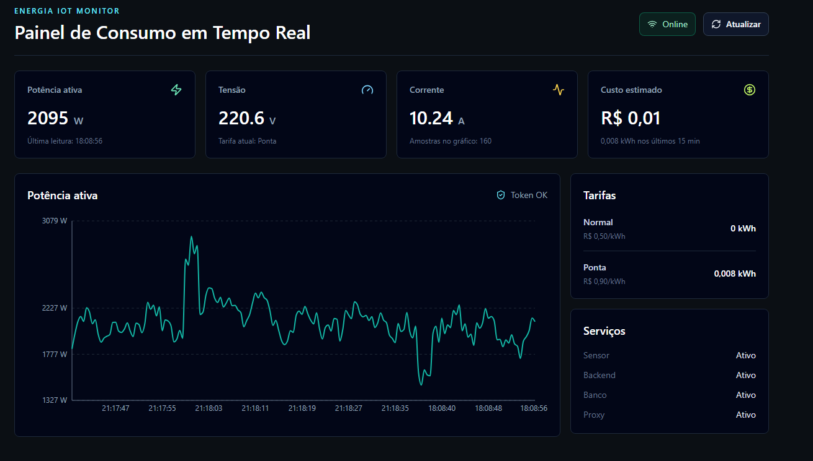

# 🚀 Felipe Fernandes

## Full Stack Developer | Backend • Frontend • Dados • SAP

💡 Construindo soluções que conectam sistemas, dados e negócio
## 📸 Demonstração

---

🎓 Estudante de Sistemas de Informação – PUC Minas (7º período)
💼 Experiência com SAP MM, dados e automação de processos
🚀 Atuação com desenvolvimento full stack e análise de dados

---

## 💻 Tecnologias e Ferramentas

### 🔧 Backend

* Python | FastAPI
* APIs REST

### 🎨 Frontend

* HTML | CSS | JavaScript
* React (básico/intermediário)

### 🗄️ Dados

* SQL | PostgreSQL
* Power BI (dashboards e KPIs)

### ⚙️ Outros

* SAP MM
* Docker

---

## 🚀 Projetos em Destaque

### 🔹 IoT Energy Monitoring

Sistema full stack para monitoramento de consumo energético em tempo real.

* Simulação de sensores
* API com FastAPI
* Banco PostgreSQL
* (em evolução) Dashboard web

### 🔹 Dashboard de Compras e Fornecedores

Análise de pedidos, atrasos e performance de fornecedores.

* KPIs estratégicos
* Foco em tomada de decisão

### 🔹 Sistema de Recomendação (Acadêmico)

Estudo sobre percepção de usuários em algoritmos de streaming.

---

## 🧠 Diferencial

Experiência prática com:

* Dados reais de empresa
* Processos de suprimentos (SAP MM)
* Automação de processos
* Desenvolvimento de APIs e sistemas
* Criação de dashboards para tomada de decisão

---

## 🎯 Meu foco

Desenvolver soluções **full stack** que integrem:

* Frontend
* Backend
* Dados
* Regras de negócio

Gerando valor real para empresas.

---

## 📫 Contato

* 💼 LinkedIn: https://www.linkedin.com/in/felipebellis/?skipRedirect=true
* 📧 Email: ffelipebellis@gmail.com

---
